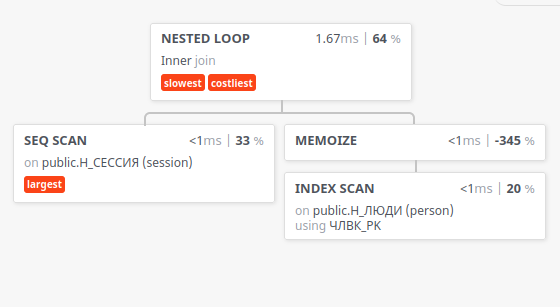
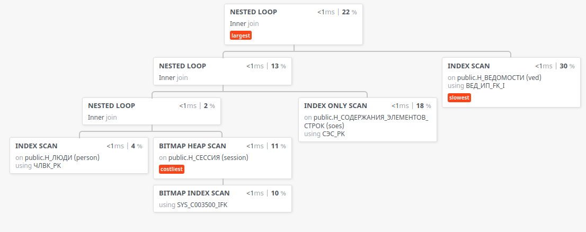

# Запрос 1

```sql
EXPLAIN (ANALYZE, COSTS, VERBOSE, BUFFERS, FORMAT JSON ) SELECT person."ИМЯ", session."ДАТА" FROM
    "Н_СЕССИЯ" session
        JOIN "Н_ЛЮДИ" person on session."ЧЛВК_ИД" = person."ИД"
WHERE person."ИМЯ" > 'Роман'
  AND session."ДАТА" > '2004-01-17';
```



## Идеи
- индекс для сессий, чтобы меньше памяти есть. вопрос, какой процент сессий затронет фильтр.
2981 останутся после фильтрации, а 471 нет. Возможно, смысл есть, если они хранятся не вперемешку.
- индекс для людей (итак есть)

join ускорить нельзя :|
(можно через денормализацию ЫЫЫ)

# Запрос 2

```sql
EXPLAIN (ANALYZE, COSTS, VERBOSE, BUFFERS, FORMAT JSON) SELECT person."ИМЯ",  ved."ДАТА", session."ЧЛВК_ИД" FROM
    "Н_СЕССИЯ" session
        RIGHT JOIN "Н_ЛЮДИ" person on session."ЧЛВК_ИД" = person."ИД"
        RIGHT JOIN "Н_СОДЕРЖАНИЯ_ЭЛЕМЕНТОВ_СТРОК" soes ON soes."ИД" = session."СЭС_ИД"
        RIGHT JOIN "Н_ВЕДОМОСТИ" ved on soes."ИД" = ved."СЭС_ИД"
WHERE person."ИД" = 100865 AND ved."ЧЛВК_ИД" < 142390 AND session."ДАТА" > '2010-01-25';
```



## Идеи
- аналогично с сессией (хотя bitmap scan по сути очень умный)
- индекс Н_СОДЕРЖАНИЯ_ЭЛЕМЕНТОВ_СТРОК по ИД 
- как изменится перфоманс, если выбирать атрибуты?

